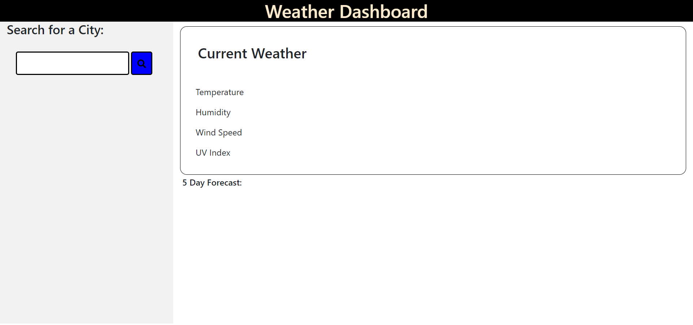
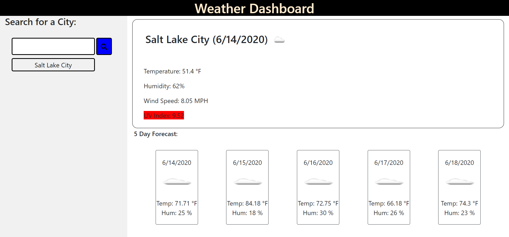
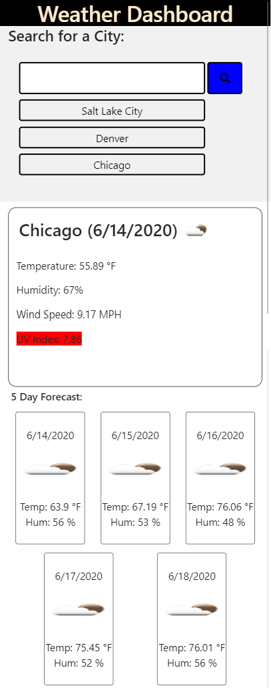

# Weather-Dashboard

https://1hoppy1.github.io/Weather-Dashboard

This website will allow a user to input a city name and will return the results of the Current Weather, and a Five Day Forecast.
The Local Memory is used and the input data will be persistent.
The Recent Search History will appear as clickable buttons that will search for the city whose name shows up on the button.
The program works well with smaller screens.

Bootstrap was used to help with formatting. https://stackpath.bootstrapcdn.com/bootstrap/4.3.1/css/bootstrap.min.css
Moment.js was used to help with the current date. https://cdnjs.cloudflare.com/ajax/libs/moment.js/2.26.0/moment.min.js
OpenWeather API was used to collect weather data. https://api.openweathermap.org

Enjoy!

